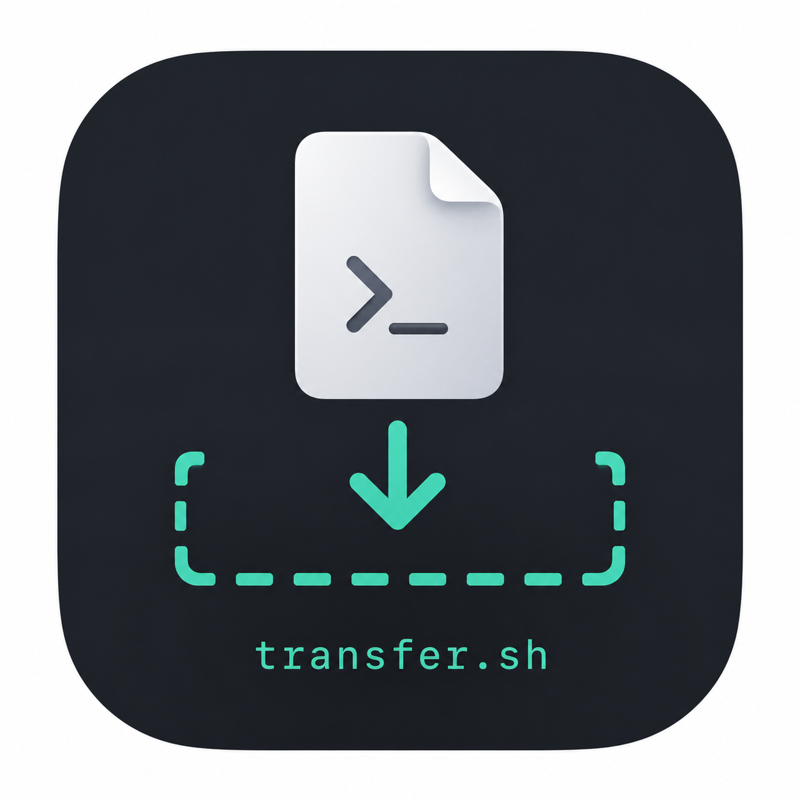

<p align="center">
  
</p>

<h1 align="center">transfer.sh</h1>

<p align="center">
  Easy and fast file sharing from the command line.
</p>

<p align="center">
  <a href="https://github.com/xenofex7/transfer.sh/actions/workflows/test.yml">
    
  </a>
  <a href="https://github.com/xenofex7/transfer.sh/pkgs/container/transfer.sh">
    
  </a>
  <a href="LICENSE">
    
  </a>
</p>

---

## About this fork

This repository is a **fork of [dutchcoders/transfer.sh](https://github.com/dutchcoders/transfer.sh)**
that has been deliberately slimmed down for a single, focused use case:

> a small, self-hosted file-drop service that runs as a container behind a
> reverse proxy, stores files on the local filesystem, scans uploads with
> ClamAV and lives behind HTTP basic auth.

The fork is **actively maintained** — see [ROADMAP.md](ROADMAP.md) for what's
on the table and what's coming next. Pull requests, ideas and bug reports are
welcome.

### What's different from upstream

| Area | Upstream | This fork |
|---|---|---|
| Storage backends | local · S3 · Google Drive · Storj | **local only** |
| TLS termination | built-in (Let's Encrypt + manual certs) | **delegated to a reverse proxy** |
| Virus scanning | ClamAV + VirusTotal | **ClamAV only** |
| Profiler / pprof | optional flag | **removed** |
| Frontend keys | Google Analytics, UserVoice | **removed** |
| Container registry | Docker Hub | **GHCR** with semver tags |
| Default purge | off | **360 days** with a 24 h sweep |

The result is a noticeably smaller dependency tree, a faster build and a tiny
runtime image.

---

## Quick start

Pull the published container image and run it with a local data directory:

```bash
docker run --rm \
  -p 8080:8080 \
  -v $(pwd)/data:/data \
  ghcr.io/xenofex7/transfer.sh:latest
```

Then, in another shell:

```bash
curl --upload-file ./hello.txt http://127.0.0.1:8080/hello.txt
```

The response body is the download URL. The `X-Url-Delete` response header
contains the deletion URL — keep both.

### Image tags

| Tag | What you get |
|---|---|
| `latest` | latest commit on `main` |
| `edge` | same as `latest`, alternative name |
| `1.0.0`, `1.0`, `1` | released versions (semver) |
| `sha-<short>` | exact commit |

Multi-arch images are built for **`linux/amd64`** and **`linux/arm64`**.

---

## Self-hosting with docker compose

A complete stack with a ClamAV sidecar lives in [`docker-compose.yml`](docker-compose.yml).

```bash
# 1. Configuration template
cp .env.example .env
$EDITOR .env

# 2. Auth file (one entry per allowed user)
htpasswd -B -c htpasswd alice
htpasswd -B    htpasswd bob

# 3. Up
docker compose up -d
```

The transfer.sh container exposes port 8080 only inside the compose network —
TLS and the public hostname are expected to be handled by your reverse proxy
of choice (nginx, Caddy, Traefik). Pass standard proxy headers
(`X-Forwarded-Host`, `X-Forwarded-Proto`) and set `client_max_body_size` to at
least the value of `MAX_UPLOAD_SIZE`.

---

## Usage

### Upload

```bash
curl --upload-file ./hello.txt https://your-instance.example.com/hello.txt
```

### Download

```bash
curl https://your-instance.example.com/<token>/hello.txt -o hello.txt
```

### Delete

```bash
curl -X DELETE https://your-instance.example.com/<token>/hello.txt/<delete-token>
```

The `<delete-token>` is returned in the `X-Url-Delete` response header on
upload.

### Encrypt + upload (client-side)

```bash
gpg --armor --symmetric --output - ./hello.txt \
  | curl --upload-file - https://your-instance.example.com/hello.txt
```

### Download + decrypt

```bash
curl https://your-instance.example.com/<token>/hello.txt | gpg --decrypt --output ./hello.txt
```

### Per-upload limits

```bash
# Auto-delete after N days (overrides the server default)
curl --upload-file ./hello.txt https://your-instance.example.com/hello.txt \
  -H "Max-Days: 7"

# Cap the download count
curl --upload-file ./hello.txt https://your-instance.example.com/hello.txt \
  -H "Max-Downloads: 1"
```

### Link aliases

Direct download (skip the preview page):

```
https://your-instance.example.com/<token>/hello.txt
→ https://your-instance.example.com/get/<token>/hello.txt
```

Inline (open in browser instead of download):

```
https://your-instance.example.com/<token>/hello.txt
→ https://your-instance.example.com/inline/<token>/hello.txt
```

### Bulk archive download

```bash
curl https://your-instance.example.com/(<token1>/file1,<token2>/file2).zip -o files.zip
curl https://your-instance.example.com/(<token1>/file1,<token2>/file2).tar
curl https://your-instance.example.com/(<token1>/file1,<token2>/file2).tar.gz
```

More examples in [`examples.md`](examples.md).

---

## Configuration

All flags can be set via CLI args or the matching environment variable.

### Network

| Flag | Env | Default | Description |
|---|---|---|---|
| `--listener` | `LISTENER` | `127.0.0.1:8080` | Address the HTTP server binds to |
| `--proxy-path` | `PROXY_PATH` | — | Path prefix when behind a reverse proxy |
| `--proxy-port` | `PROXY_PORT` | — | External port of the reverse proxy |
| `--cors-domains` | `CORS_DOMAINS` | — | Comma-separated list of CORS origins |

### Storage

| Flag | Env | Default | Description |
|---|---|---|---|
| `--basedir` | `BASEDIR` | *required* | Path to the local storage directory |
| `--temp-path` | `TEMP_PATH` | OS temp | Path used for in-flight uploads |

### Lifecycle

| Flag | Env | Default | Description |
|---|---|---|---|
| `--purge-days` | `PURGE_DAYS` | `360` | Days after which uploads are purged |
| `--purge-interval` | `PURGE_INTERVAL` | `24` | Hours between purge runs |
| `--max-upload-size` | `MAX_UPLOAD_SIZE` | unlimited | Per-file limit in KB |
| `--rate-limit` | `RATE_LIMIT` | `0` | Requests per minute (0 = off) |
| `--random-token-length` | `RANDOM_TOKEN_LENGTH` | `10` | URL token length |

### Authentication & access control

| Flag | Env | Description |
|---|---|---|
| `--http-auth-user` / `--http-auth-pass` | `HTTP_AUTH_USER` / `HTTP_AUTH_PASS` | Single-user basic auth |
| `--http-auth-htpasswd` | `HTTP_AUTH_HTPASSWD` | Path to a htpasswd file (multi-user) |
| `--http-auth-ip-whitelist` | `HTTP_AUTH_IP_WHITELIST` | CIDRs that may upload without auth |
| `--ip-whitelist` | `IP_WHITELIST` | CIDRs allowed at the connection level |
| `--ip-blacklist` | `IP_BLACKLIST` | CIDRs denied at the connection level |

### Antivirus

| Flag | Env | Description |
|---|---|---|
| `--clamav-host` | `CLAMAV_HOST` | clamd host:port (e.g. `clamav:3310`) |
| `--perform-clamav-prescan` | `PERFORM_CLAMAV_PRESCAN` | Refuse uploads that fail the prescan |

### Frontend / misc

| Flag | Env | Description |
|---|---|---|
| `--web-path` | `WEB_PATH` | Override the bundled web frontend directory |
| `--email-contact` | `EMAIL_CONTACT` | Address rendered in the "Contact" link |
| `--log` | `LOG` | Log file path (defaults to stderr) |

---

## Development

Requires Go 1.23+.

```bash
git clone git@github.com:xenofex7/transfer.sh.git
cd transfer.sh
go run . --listener 127.0.0.1:8080 --basedir ./tmp/storage --temp-path ./tmp
```

Or, for a production-style binary:

```bash
go build -tags netgo \
  -ldflags "-X github.com/dutchcoders/transfer.sh/cmd.Version=dev -s -w" \
  -o transfersh ./
```

Run the tests and the linter:

```bash
go test -race ./...
golangci-lint run --config .golangci.yml
```

CI runs both on every push (see `.github/workflows/test.yml`).

---

## Shell helper

A minimal `transfer` function for `~/.bashrc` or `~/.zshrc`:

```bash
transfer() {
  if [ $# -eq 0 ]; then
    echo "Usage: transfer <file>"
    return 1
  fi
  curl --progress-bar --upload-file "$1" \
    "https://your-instance.example.com/$(basename "$1")"
}
```

Then:

```bash
transfer hello.txt
```

---

## Roadmap

The current state and the planned work are tracked in [ROADMAP.md](ROADMAP.md).
The repository is a small, opinionated rewrite — feedback and PRs are welcome.

---

## Credits

Built on top of the original work by:

- **Remco Verhoef** & **Uvis Grinfelds** — original creators of `transfer.sh`
- **Andrea Spacca** & **Stefan Benten** — long-time upstream maintainers

This fork keeps the upstream copyright notice intact and ships under the same
[MIT license](LICENSE).
